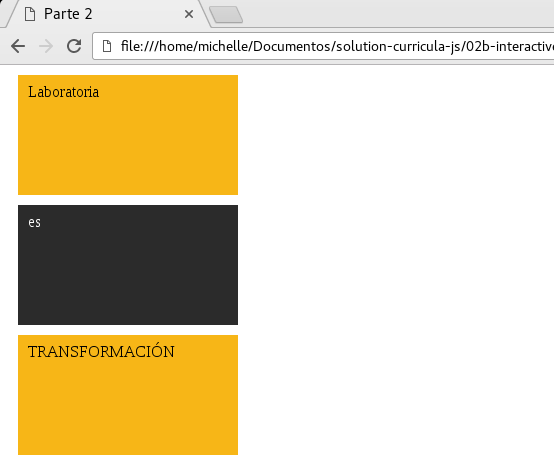
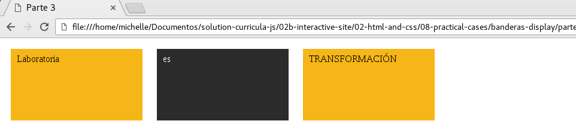
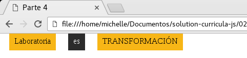

### Ejercicios Guiados - Banderas Display

**Parte 1** Mostramos los parrafos en bloques, para este caso utilizamos display: block.

**Parte 2** Mostramos los parrafos en bloques pero con un tañano determinado, para este caso utlizamos display:block.

**Parte 3** Mostramos los parrafos en bloques, para este caso utilizamos display: block.

**Parte 4** Mostramos los parrafos en bloques pero con un tañano determinado, para este caso utlizamos display:block.

